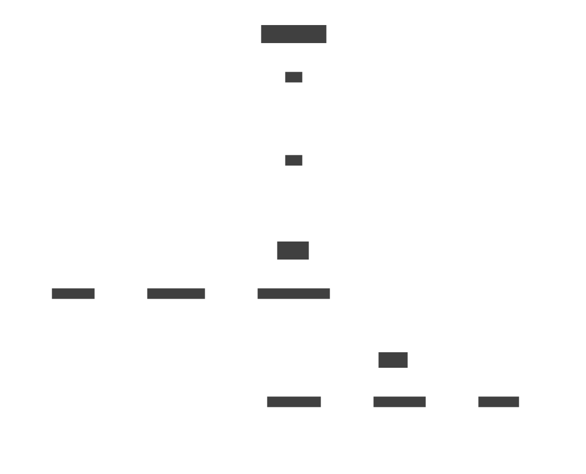

## Tauri：轻量产物，却不轻量本身——深入解析

### 1. 为什么 Tauri 构成了一个“重量级”框架？

- **复杂的 Rust 生态依赖**
  Tauri 并不是一个“薄壳”，而是聚合了多个 Rust 核心组件，比如 `tauri`, `tauri-runtime`, `tauri-macros`, `tauri-utils`, `tauri-build`, `tauri-codegen`, WRY 和 TAO 等。它们负责抽象平台调用、生成代码、打包构建和运行时支持。换句话说，它是一个模块丰富、功能齐全但自身“吃力”的工具链([Tauri][1])。

核心生态系统:

* tauri: 主要的 crate，将所有内容结合在一起。它将运行时、宏、工具和 API 整合成一个最终产品。提供了与前端交互、应用生命周期管理等功能。
* tauri-runtime: Tauri 本身与底层 Webview 库之间的粘合层，提供了一个抽象层，用于不同的运行时环境（如 WRY）。
* tauri-macros: 通过利用 tauri-codegen crate 为上下文、处理程序和命令创建宏，帮助开发者更方便地使用 Tauri 的功能。
* tauri-utils: 提供了一些实用工具函数，辅助开发过程。在许多地方重复使用的通用代码，提供有用的工具，如解析配置文件、检测平台三元组、注入 CSP 和管理资产。
* tauri-build: 一个构建脚本库，帮助在编译时生成必要的代码。在构建时应用宏，以设置 cargo 所需的一些特殊功能。
* tauri-codegen: 用于在编译期生成绑定代码。嵌入、哈希和压缩资产，包括应用程序的图标以及系统托盘。在编译时解析tauri.conf.json并生成 Config 结构。
* tauri-runtime-wry: 这个 crate 为 WRY 打开了直接的系统级交互，例如打印、监视器检测和其他与窗口相关的任务。

- **构建时间显著更长**
  构建 Tauri 应用需要编译 Rust 后端，无论是首次构建抑或 release 模式，耗时往往显著长于纯前端工具链。某次对比测试显示，Tauri 构建可能耗时超过 **1 分钟**，而 Electron 更快([gethopp.app][2])。Reddit 社区也普遍反映：

  > “I have 1000+ dependencies… The build times are excruciating.”
  > “it was taking me about 2.5 minutes on a high-tier Ryzen... My M4 Mac does it in about 45 seconds”([Reddit][3])

### 2. 实际的轻量优势体现在 “产物” 而非框架本身

- **生成的应用非常小**
  Tauri 应用之所以被广泛认为“轻量”，是因为它的最终打包体积真的非常小。依赖系统自带 WebView，不会像 Electron 那样打包整个 Chromium，导致应用大小从几百 MB 级别降至几 MB 级别。

- **运行时资源使用更低**
  运行过程中，Tauri 应用由于没有 Node.js 和 Chromium 实例，其内存占用显著低于 Electron，提升应用性能体验。

- **可通过优化减少产物体积**
  官方还提供优化指南，例如启用 release 模式下的 `lto`, `strip`, `opt-level="s"` 等可以进一步压缩二进制体积，追求极致轻量甚至可做到只有 **3 MB** 左右的发布包([Medium][4], [Tauri][5])。

### 3. 小结对比表

| 方面           | Tauri 框架本身              | Tauri 应用产物     |
| -------------- | --------------------------- | ------------------ |
| 构建速度       | 慢（Rust 编译依赖较多）     | —                  |
| 框架内依赖量   | 多种 Rust crate，构建重量级 | —                  |
| 最终包体积     | —                           | 小（几 MB 级）     |
| 运行时资源消耗 | —                           | 低（内存、启动快） |

---
